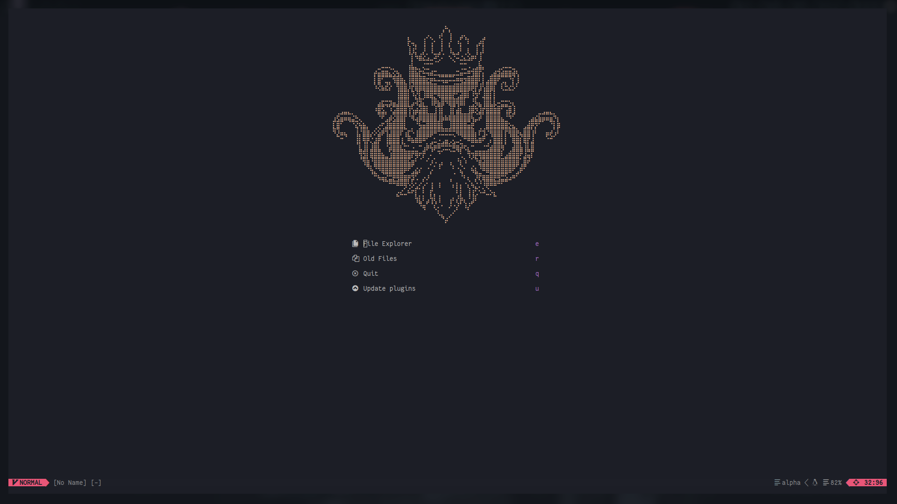

<h1 align=center>
    Nvim config
</h1>

\
**Forked from [Dragonixj's Nvim](https://github.com/Dragonixj/nvim-config)**\
using

- **[lsp-zero](https://github.com/VonHeikemen/lsp-zero.nvim)**
- **[Mason](https://github.com/williamboman/mason.nvim)**

to handle **[nvim-cmp](https://github.com/hrsh7th/nvim-cmp)** with other
plugins...

---

## Install

#### Deps

- fd
- neovim
- rg
- python-pynvim

```bash
[ -f ~/.config/nvim/ ] && mv ~/.config/nvim ~/.config/nvim-backup  
git clone https://github.com/punixcorn/neovim-config ~/.config/nvim
```

#### Run neovim to complete

```bash
nvim
```
